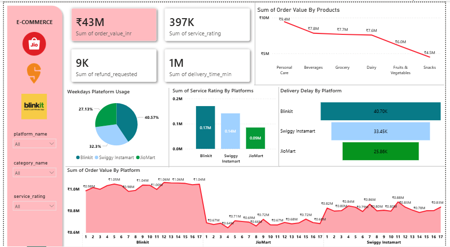

# 🛒 Quick Commerce Data Analysis

## 📌 Project Overview
This project provides an end-to-end data analysis of Quick Commerce operations. The goal is to extract meaningful business insights regarding sales performance, order trends, and operational efficiency using a comprehensive data stack.

## 🛠️ Tools & Technologies Used
* **Microsoft Excel / CSV:** Initial data storage, inspection, and preliminary cleaning.
* **SQL:** Advanced data querying, aggregations, and extracting key business metrics.
* **Python (Jupyter Notebook):** In-depth Exploratory Data Analysis (EDA), data cleaning, and statistical analysis using libraries like Pandas and Matplotlib/Seaborn.
* **Power BI:** Interactive data visualization and dashboard creation for stakeholder reporting.

## 📂 Repository Structure
* `QuickCommerce-python.ipynb`: Python notebook containing the EDA and data transformation steps.
* `QuickCommerce SQL.sql`: SQL scripts used for querying the database and generating analytical views.
* `QuickCommerce Power-BI.pbit`: Power BI Template file to explore the interactive dashboard.
* `QuickCommerce.csv` & other data files: The dataset used for this analysis.
* `image_afbc84.png`: Static preview of the Power BI dashboard.

## 📊 Key Insights
*(Note: Replace the bracketed text with your actual findings)*
1. **Sales Trends:** [e.g., Peak order volumes occur during evening hours and weekends.]
2. **Customer Retention:** [e.g., Repeat customers contribute to X% of total revenue.]
3. **Operational Efficiency:** [e.g., Average delivery time is X minutes, with a 95% on-time delivery rate.]
4. **Product Performance:** [e.g., The 'Groceries' category has the highest turnover rate.]

## 🚀 How to Use This Repository
1. **Data Preview:** You can view the raw data files (`.csv`) directly here on GitHub.
2. **Python Analysis:** Open `QuickCommerce-python.ipynb` to view the code, logic, and visual outputs.
3. **SQL Queries:** Review the `QuickCommerce SQL.sql` file for the exact database queries used.
4. **Power BI Dashboard:** Download the `QuickCommerce Power-BI.pbit` file and open it in Power BI Desktop to interact with the visualizations.

---
*This project was created to demonstrate full-stack data analysis skills.*
